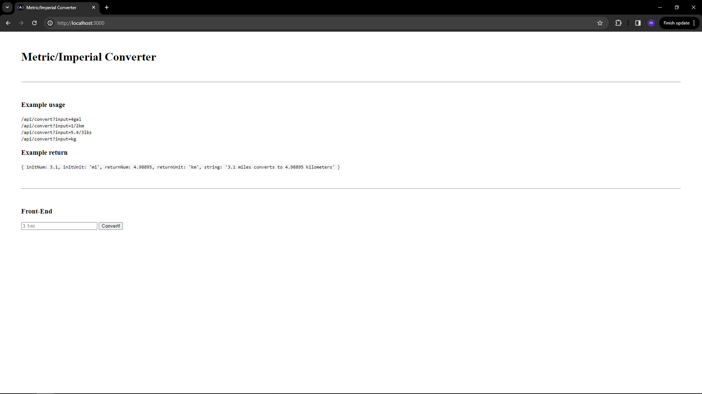

# Metric-Imperial Converter

This is a simple project that I did to get the [Quality Assurance course](https://www.freecodecamp.org/learn/quality-assurance) by FreeCodeCamp. The boilerplate can be found at [this link](https://www.freecodecamp.org/learn/quality-assurance/quality-assurance-projects/metric-imperial-converter).

## Explanation about the project

These are the requirements that I have fulfilled to complete this project:

- Complete the necessary conversion logic in /controllers/convertHandler.js
- Complete the necessary routes in /routes/api.js
  Copy the sample.env file to .env and set the variables appropriately
- To run the tests automatically, add NODE_ENV=test in your .env file
- To run the tests in the console, use the command npm run test.

I have also written some tests in **tests/1_unit-tests.js**. These are the criteria:

- convertHandler should correctly read a whole number input.
- convertHandler should correctly read a decimal number input.
- convertHandler should correctly read a fractional input.
- convertHandler should correctly read a fractional input with a decimal.
- convertHandler should correctly return an error on a double-fraction (i.e. 3/2/3).
- convertHandler should correctly default to a numerical input of 1 when no numerical input is provided.
- convertHandler should correctly read each valid input unit.
- convertHandler should correctly return an error for an invalid input unit.
- convertHandler should return the correct return unit for each valid input unit.
- convertHandler should correctly return the spelled-out string unit for each valid input unit.
- convertHandler should correctly convert gal to L.
- convertHandler should correctly convert L to gal.
- convertHandler should correctly convert mi to km.
- convertHandler should correctly convert km to mi.
- convertHandler should correctly convert lbs to kg.
- convertHandler should correctly convert kg to lbs.

I have also written some functional tests in **tests/2_functional-tests.js**. These are the criteria:

- Convert a valid input such as 10L: GET request to /api/convert.
- Convert an invalid input such as 32g: GET request to /api/convert.
- Convert an invalid number such as 3/7.2/4kg: GET request to /api/convert.
- Convert an invalid number AND unit such as 3/7.2/4kilomegagram: GET request to /api/convert.
- Convert with no number such as kg: GET request to /api/convert.

## To run project

### Requirements

To run the project you need to have:

- Internet Connection
- Visual studio code installed
- Node installed

### Steps to run the project

- Git clone this project
- go to root project
- Write: npm install
- Write: npm run start

### To run tests

- run: npm run test

### To run the project automatically:

- add NODE_ENV=test in your .env file
